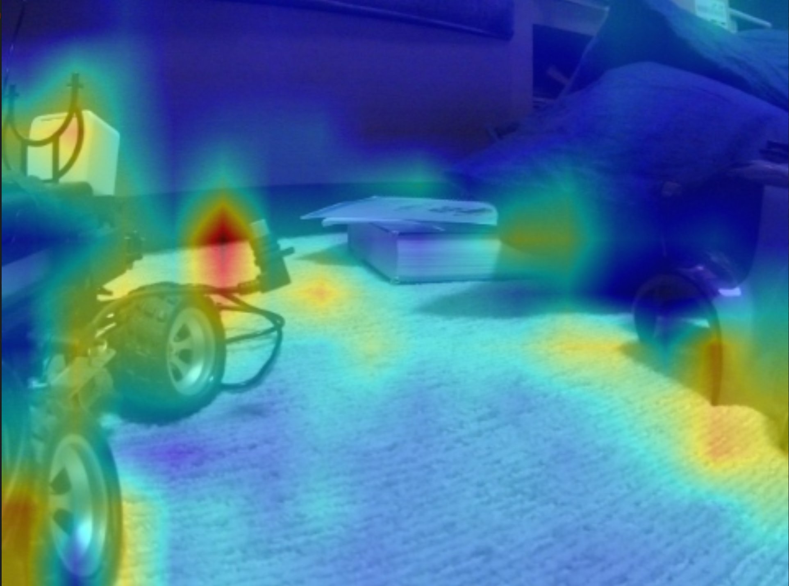

# AWS DeepRacer Video Visualizations
Repository containing tools to visualize AWS DeepRacer (training) runs. Currently only a visualization based on GradCam is supported.

# Setup
If you have a computer that has an NVIDIA GPU it is recommended to setup CUDA to work with tensorflow-gpu version 1.14.0. See the following links for help:
- [CUDA/TF Compatibility](https://www.tensorflow.org/install/source#linux)
- [CUDA 10.0 Install](https://developer.nvidia.com/cuda-10.0-download-archive?target_os=Linux&target_arch=x86_64&target_distro=Ubuntu&target_version=1804&target_type=debnetwork)
- `sudo apt-get install cuda-libraries-10.0`

## Requirements
- Python 3
- [Poetry](https://github.com/sdispater/poetry)

## Installation
First prepare the Python enviroment using `poetry install`.
Available tools can be found in the `tools` folder. Before running a tool make sure the virtual environment is activated using `poetry shell`. You may need to use a venv or conda env to get the right python version (3.7) for poetry.

## Downloading your model
You can obtain your model graph in the form of a `.pb` file either from S3 or from the DeepRacer console.
- S3 -> Go to the S3 folder in which the training run is stored. Here you can download the model files per checkpoint.
- Console -> Select your training run and choose `Download model`. Inside the obtained `.tar.gz` you can find your `model.pb` file. 

# Visualization tools
Example of real world visualization: run `python tools/gradcam.py  ~/Desktop/model.pb 1  -i 192.168.1.*** -p ********` for live gradCAM of DeepRacer feed. Make sure you are on the same wifi network as your DeepRacer and that you have the correct IP and password. Press `esc` to stop running the program.

Use the fps argument to tune the framerate and latency. By default it is at 10fps, but if you have more latency you can try lowering the fps until it improves.

## Kinesis Downloader
Can be used to view and store the live feed of a training job. This is the same feed that is shown in the AWS DeepRacer console.

`python download_kinesis.py <Kinesis Video Stream Name> -o <output_file.mp4>`

## GradCam
Overlays a Gradient-weighted Class Activation Mapping ([Grad-CAM, Selvaraju et al.](https://arxiv.org/abs/1610.02391)) over an input video for a given action.
It takes as input the action number of the action in `model_metadata.json` or the DeepRacer console for which it then computes the activation map using the model stored in `model.pb`.

`python gradcam.py <input_file.mp4> -m <model.pb file path> -a <action index> -o <output_file.mp4>`
